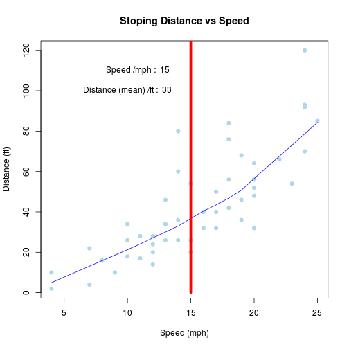

My First Shiny App Presentation 
========================================================
author: Donald Dominko
date: February 22, 2015

Cousera Data Science Specialization (slide 1)

About the App (slide 2)
========================================================

This is a very basic app given the short time frame for
the project.  

It involves three parts of the window
- Header panel is where you will find the title i.e. 
"Demo for 'cars' dataset!"
- Sidebar panel is where you have a slider you can move
- Main panel is on the right and is where you see the plot

About Data (slide 3)
========================================================
The data gives the speed for cars and the distances that 
takes them to stop.   
Note that the data were recorded in the 1920s. Speed is
in MPH and distance is in FT.

Data frame has two columns: speed and dist

```
  speed dist
1     4    2
2     4   10
3     7    4
4     7   22
5     8   16
6     9   10
```

How to Use App (slide 4)
===
The App is accesible on this address:
http://donalddominko.shinyapps.io/CourseraDataProducts
  
Move the slider left and right and the plot on the right
will change as a result.  
  
What happens is when you change
the value on a slider it notifies server script which
plots a plot with new value and that is what you get as
a result.

Slide With Plot (slide 5)
========================================================
Example with the speed = 15
 
